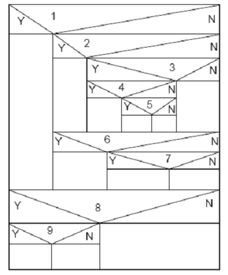

# 一.简答题（共7 题,100.0分）

## 1
请使用等价类划分法为NextDate函数列出输入域等价类表，并设计相应的测试用例。
填写答案:

NextDate 函数输入：年(year)、月(month)、日(day)

\[
\text{输入域等价类表}
\]

\[
\begin{array}{|c|c|c|c|c|}
\hline
\text{输入条件} & \text{有效等价类} & \text{编号} & \text{无效等价类} & \text{编号} \\
\hline
\text{年份} & 1900\text{--}2100 & 1 & <1900 & 7 \\
& & & >2100 & 8 \\
\hline
\text{月份} & 1\text{--}12 & 2 & <1 & 9 \\
& & & >12 & 10 \\
\hline
\text{日期} & 1\text{--}28\text{（所有月份）} & 3 & <1 & 11 \\
& 29\text{（闰年2月）} & 4 & >31 & 12 \\
& 29\text{（非闰年2月）} & 5 & 30\text{（2月）} & 13 \\
& 30\text{（4,6,9,11月）} & 6 & 31\text{（2月）} & 14 \\
& 31\text{（1,3,5,7,8,10,12月）} & 7 & 31\text{（4,6,9,11月）} & 15 \\
& 30\text{（1,3,5,7,8,10,12月）} & 8 & 32\text{（1,3,5,7,8,10,12月）} & 16 \\
\hline
\end{array}
\]

\[
\text{测试用例设计}
\]

\[
\begin{array}{|c|c|c|c|c|c|}
\hline
\text{用例ID} & \text{年} & \text{月} & \text{日} & \text{预期输出} & \text{覆盖等价类} \\
\hline
\text{TC1} & 2000 & 6 & 15 & 2000/6/16 & 1,2,3 \\
\text{TC2} & 2000 & 2 & 28 & 2000/2/29 & 1,2,3\text{（闰年2月）} \\
\text{TC3} & 2000 & 2 & 29 & 2000/3/1 & 1,2,4\text{（闰年2月29日）} \\
\text{TC4} & 2001 & 2 & 28 & 2001/3/1 & 1,2,3\text{（非闰年2月）} \\
\text{TC5} & 2000 & 4 & 30 & 2000/5/1 & 1,2,6\text{（30天月份）} \\
\text{TC6} & 2000 & 1 & 31 & 2000/2/1 & 1,2,7\text{（31天月份）} \\
\text{TC7} & 2000 & 12 & 31 & 2001/1/1 & 1,2,7\text{（年末）} \\
\text{TC8} & 1899 & 6 & 15 & \text{无效输入} & 7 \\
\text{TC9} & 2101 & 6 & 15 & \text{无效输入} & 8 \\
\text{TC10} & 2000 & 0 & 15 & \text{无效输入} & 9 \\
\text{TC11} & 2000 & 13 & 15 & \text{无效输入} & 10 \\
\text{TC12} & 2000 & 6 & 0 & \text{无效输入} & 11 \\
\text{TC13} & 2000 & 6 & 32 & \text{无效输入} & 12 \\
\text{TC14} & 2000 & 2 & 30 & \text{无效输入} & 13 \\
\text{TC15} & 2000 & 2 & 31 & \text{无效输入} & 14 \\
\text{TC16} & 2000 & 4 & 31 & \text{无效输入} & 15 \\
\hline
\end{array}
\]

## 2

假设商店货品价格(R) 都不大于100元(且为整数)，若顾客付款(P)在100元内，现有一个程序能在每位顾客付款后给出找零钱的最佳组合(找给顾客货币张数最少)。 假定此商店的货币面值只包括:50元(N50)、10元(N10)、 5元(N5)、1元(N1) 四种。  
请结合等价类划分法和边界值分析法为上述程序设计出相应的测试用例。  
填写答案:

\[
\text{等价类划分}
\]

\[
\begin{array}{|c|c|c|c|c|}
\hline
\text{输入条件} & \text{有效等价类} & \text{编号} & \text{无效等价类} & \text{编号} \\
\hline
\text{价格 }R & 1\text{--}100\text{（整数）} & 1 & <1 & 5 \\
& & & >100 & 6 \\
& & & \text{非整数} & 7 \\
\hline
\text{付款 }P & R \le P \le 100\text{（整数）} & 2 & P < R & 8 \\
& & & P > 100 & 9 \\
& & & \text{非整数} & 10 \\
\hline
\text{找零金额} & P-R = 0 & 3 & - & - \\
& P-R > 0 & 4 & - & - \\
\hline
\end{array}
\]

\[
\text{边界值分析}
\]

\[
\begin{aligned}
\text{价格 }R &: 0,\,1,\,50,\,99,\,100,\,101 \\
\text{付款 }P &: R-1,\,R,\,R+1,\,50,\,99,\,100,\,101 \\
\text{找零金额} &: 0,\,1,\,5,\,10,\,50,\,99
\end{aligned}
\]

\[
\text{测试用例设计}
\]

\[
\begin{array}{|c|c|c|c|c|c|}
\hline
\text{用例ID} & \text{价格 }R & \text{付款 }P & \text{找零} & \text{预期输出（N50,N10,N5,N1）} & \text{测试类型} \\
\hline
\text{TC1} & 1 & 1 & 0 & (0,0,0,0) & \text{等价类+边界值} \\
\text{TC2} & 1 & 2 & 1 & (0,0,0,1) & \text{等价类+边界值} \\
\text{TC3} & 50 & 50 & 0 & (0,0,0,0) & \text{等价类} \\
\text{TC4} & 50 & 100 & 50 & (1,0,0,0) & \text{等价类+边界值} \\
\text{TC5} & 99 & 100 & 1 & (0,0,0,1) & \text{等价类+边界值} \\
\text{TC6} & 100 & 100 & 0 & (0,0,0,0) & \text{等价类+边界值} \\
\text{TC7} & 1 & 51 & 50 & (1,0,0,0) & \text{等价类} \\
\text{TC8} & 1 & 11 & 10 & (0,1,0,0) & \text{等价类} \\
\text{TC9} & 1 & 6 & 5 & (0,0,1,0) & \text{等价类} \\
\text{TC10} & 1 & 4 & 3 & (0,0,0,3) & \text{等价类} \\
\text{TC11} & 1 & 61 & 60 & (1,1,0,0) & \text{等价类（组合）} \\
\text{TC12} & 1 & 16 & 15 & (0,1,1,0) & \text{等价类（组合）} \\
\text{TC13} & 1 & 8 & 7 & (0,0,1,2) & \text{等价类（组合）} \\
\text{TC14} & 0 & 50 & - & \text{无效输入} & \text{无效等价类} \\
\text{TC15} & 101 & 50 & - & \text{无效输入} & \text{无效等价类} \\
\text{TC16} & 50 & 49 & - & \text{无效输入（P<R）} & \text{无效等价类} \\
\text{TC17} & 50 & 101 & - & \text{无效输入（P>100）} & \text{无效等价类} \\
\text{TC18} & 1 & 100 & 99 & (1,4,1,4) & \text{边界值（最大找零）} \\
\hline
\end{array}
\]

## 3

某软件的一个模块的需求规格说明书中描述：  
(1) 年薪制员工：严重过失，扣年终风险金的4%；过失，扣年终风险金的2%。  
(2) 非年薪制员工：严重过失，扣当月薪资的8%；过失，扣当月薪资的4%。  
请绘制出因果图和判定表，并给出相应的测试用例。  
填写答案:

\[
\text{因果图分析}
\]

\[
\begin{aligned}
\text{原因（输入条件）：}& \\
C1 &: \text{是年薪制员工} \\
C2 &: \text{是严重过失} \\
C3 &: \text{是过失}
\end{aligned}
\]

\[
\begin{aligned}
\text{结果（输出）：}& \\
E1 &: \text{扣年终风险金的4\%} \\
E2 &: \text{扣年终风险金的2\%} \\
E3 &: \text{扣当月薪资的8\%} \\
E4 &: \text{扣当月薪资的4\%}
\end{aligned}
\]

\[
\text{约束关系：C2 和 C3 互斥，不能同时为真}
\]

\[
\text{判定表}
\]

\[
\begin{array}{|c|c|c|c|c|c|c|c|c|}
\hline
\text{规则} & 1 & 2 & 3 & 4 & 5 & 6 & 7 & 8 \\
\hline
\text{条件} & & & & & & & & \\
\hline
C1:\text{ 年薪制员工} & 1 & 1 & 1 & 1 & 0 & 0 & 0 & 0 \\
C2:\text{ 严重过失} & 1 & 1 & 0 & 0 & 1 & 1 & 0 & 0 \\
C3:\text{ 过失} & 0 & 0 & 1 & 1 & 0 & 0 & 1 & 1 \\
\hline
\text{动作} & & & & & & & & \\
\hline
E1:\text{ 扣年终风险金4\%} & \checkmark & \checkmark & - & - & - & - & - & - \\
E2:\text{ 扣年终风险金2\%} & - & - & \checkmark & \checkmark & - & - & - & - \\
E3:\text{ 扣当月薪资8\%} & - & - & - & - & \checkmark & \checkmark & - & - \\
E4:\text{ 扣当月薪资4\%} & - & - & - & - & - & - & \checkmark & \checkmark \\
\hline
\text{不可能情况} & \times & \times & \times & \times & \times & \times & - & - \\
\hline
\end{array}
\]

注：规则 1–6 中 C2 和 C3 不能同时为真，但判定表中列出所有组合以便分析。

\[
\text{简化判定表（去除不可能情况）}
\]

\[
\begin{array}{|c|c|c|c|c|}
\hline
\text{规则} & 1 & 2 & 3 & 4 \\
\hline
\text{条件} & & & & \\
\hline
C1:\text{ 年薪制员工} & 1 & 1 & 0 & 0 \\
C2:\text{ 严重过失} & 1 & 0 & 1 & 0 \\
C3:\text{ 过失} & 0 & 1 & 0 & 1 \\
\hline
\text{动作} & & & & \\
\hline
E1:\text{ 扣年终风险金4\%} & \checkmark & - & - & - \\
E2:\text{ 扣年终风险金2\%} & - & \checkmark & - & - \\
E3:\text{ 扣当月薪资8\%} & - & - & \checkmark & - \\
E4:\text{ 扣当月薪资4\%} & - & - & - & \checkmark \\
\hline
\end{array}
\]

\[
\text{测试用例}
\]

\[
\begin{array}{|c|c|c|c|c|}
\hline
\text{用例ID} & \text{员工类型} & \text{过失类型} & \text{预期结果} & \text{覆盖规则} \\
\hline
\text{TC1} & \text{年薪制} & \text{严重过失} & \text{扣年终风险金的4\%} & \text{规则1} \\
\text{TC2} & \text{年薪制} & \text{过失} & \text{扣年终风险金的2\%} & \text{规则2} \\
\text{TC3} & \text{非年薪制} & \text{严重过失} & \text{扣当月薪资的8\%} & \text{规则3} \\
\text{TC4} & \text{非年薪制} & \text{过失} & \text{扣当月薪资的4\%} & \text{规则4} \\
\text{TC5} & \text{年薪制} & \text{无过失} & \text{不扣款} & \text{边界情况} \\
\text{TC6} & \text{非年薪制} & \text{无过失} & \text{不扣款} & \text{边界情况} \\
\hline
\end{array}
\]

## 4

某城市电话号码由三部分组成，分别是:
地区码—— 空白或三位数字;
前 缀—— 非‘0’或‘1’开头的三位数字;
后 缀—— 4位数字。
假定被测程序能接受一切符合上述规定的电话号码， 拒绝所有不符合规定的电话号码。要求:
(1)请选择适当的黑盒测试方法，写出选择该方法的原因，并使用该方法的步骤，给出测试用例表。
(2)如果所生成的测试用例不够全面，请考虑用别的测试 方法生成一些补充的测试用例。
填写答案:

### (1) 选择等价类划分法

\[
\text{选择原因：输入域规则清晰，适合划分有效/无效等价类，并系统覆盖各种电话号码格式。}
\]

\[
\text{等价类划分步骤：}
\]

\[
\begin{aligned}
1.&\ \text{分析输入条件，确定等价类} \\
2.&\ \text{为每个等价类编号} \\
3.&\ \text{设计测试用例，覆盖有效和无效等价类}
\end{aligned}
\]

\[
\text{等价类划分表}
\]

\[
\begin{array}{|c|c|c|c|c|}
\hline
\text{输入条件} & \text{有效等价类} & \text{编号} & \text{无效等价类} & \text{编号} \\
\hline
\text{地区码} & \text{空白} & 1 & \text{非空白非三位数字} & 5 \\
& \text{三位数字（000-999）} & 2 & \text{少于三位数字} & 6 \\
& & & \text{多于三位数字} & 7 \\
& & & \text{包含非数字字符} & 8 \\
\hline
\text{前缀} & \text{2–9 开头的三位数字} & 3 & \text{0 开头的三位数字} & 9 \\
& & & \text{1 开头的三位数字} & 10 \\
& & & \text{少于三位数字} & 11 \\
& & & \text{多于三位数字} & 12 \\
& & & \text{包含非数字字符} & 13 \\
\hline
\text{后缀} & \text{4 位数字（0000-9999）} & 4 & \text{少于 4 位数字} & 14 \\
& & & \text{多于 4 位数字} & 15 \\
& & & \text{包含非数字字符} & 16 \\
\hline
\end{array}
\]

\[
\text{测试用例表（等价类划分法）}
\]

\[
\begin{array}{|c|c|c|c|c|c|}
\hline
\text{用例ID} & \text{地区码} & \text{前缀} & \text{后缀} & \text{预期结果} & \text{覆盖等价类} \\
\hline
\text{TC1} & \text{空白} & 234 & 5678 & \text{接受} & 1,3,4 \\
\text{TC2} & 010 & 234 & 5678 & \text{接受} & 2,3,4 \\
\text{TC3} & 999 & 234 & 5678 & \text{接受} & 2,3,4 \\
\text{TC4} & \text{空白} & 234 & 0000 & \text{接受} & 1,3,4\text{（边界）} \\
\text{TC5} & \text{空白} & 234 & 9999 & \text{接受} & 1,3,4\text{（边界）} \\
\text{TC6} & \text{空白} & 234 & 1234 & \text{接受} & 1,3,4 \\
\text{TC7} & \text{空白} & 999 & 5678 & \text{接受} & 1,3,4\text{（前缀边界）} \\
\text{TC8} & \text{空白} & 200 & 5678 & \text{接受} & 1,3,4\text{（前缀边界）} \\
\text{TC9} & 01 & 234 & 5678 & \text{拒绝} & 6 \\
\text{TC10} & 0123 & 234 & 5678 & \text{拒绝} & 7 \\
\text{TC11} & 01A & 234 & 5678 & \text{拒绝} & 8 \\
\text{TC12} & \text{空白} & 034 & 5678 & \text{拒绝} & 9 \\
\text{TC13} & \text{空白} & 134 & 5678 & \text{拒绝} & 10 \\
\text{TC14} & \text{空白} & 23 & 5678 & \text{拒绝} & 11 \\
\text{TC15} & \text{空白} & 2345 & 5678 & \text{拒绝} & 12 \\
\text{TC16} & \text{空白} & 23A & 5678 & \text{拒绝} & 13 \\
\text{TC17} & \text{空白} & 234 & 567 & \text{拒绝} & 14 \\
\text{TC18} & \text{空白} & 234 & 56789 & \text{拒绝} & 15 \\
\text{TC19} & \text{空白} & 234 & 567A & \text{拒绝} & 16 \\
\hline
\end{array}
\]

### (2) 补充测试用例（边界值分析法）

\[
\text{选择原因：等价类划分可能遗漏边界值，需补充分界测试。}
\]

\[
\text{补充测试用例(边界值分析法)：}
\]

\[
\begin{array}{|c|c|c|c|c|c|}
\hline
\text{用例ID} & \text{地区码} & \text{前缀} & \text{后缀} & \text{预期结果} & \text{测试类型} \\
\hline
\text{TC20} & \text{空白} & 200 & 0000 & \text{接受} & \text{边界值（前缀最小，后缀最小）} \\
\text{TC21} & \text{空白} & 999 & 9999 & \text{接受} & \text{边界值（前缀最大，后缀最大）} \\
\text{TC22} & 000 & 234 & 5678 & \text{接受} & \text{边界值（地区码最小）} \\
\text{TC23} & 999 & 234 & 5678 & \text{接受} & \text{边界值（地区码最大）} \\
\text{TC24} & \text{空白} & 201 & 5678 & \text{接受} & \text{边界值（前缀接近最小值）} \\
\text{TC25} & \text{空白} & 998 & 5678 & \text{接受} & \text{边界值（前缀接近最大值）} \\
\text{TC26} & \text{空白} & 234 & 0001 & \text{接受} & \text{边界值（后缀接近最小值）} \\
\text{TC27} & \text{空白} & 234 & 9998 & \text{接受} & \text{边界值（后缀接近最大值）} \\
\hline
\end{array}
\]

\[
\text{补充测试用例（错误推测法）}
\]

\[
\begin{array}{|c|c|c|c|c|c|}
\hline
\text{用例ID} & \text{地区码} & \text{前缀} & \text{后缀} & \text{预期结果} & \text{测试类型} \\
\hline
\text{TC28} & \text{null} & 234 & 5678 & \text{拒绝} & \text{错误推测（空指针）} \\
\text{TC29} & \text{空白} & \text{null} & 5678 & \text{拒绝} & \text{错误推测（空指针）} \\
\text{TC30} & \text{空白} & 234 & \text{null} & \text{拒绝} & \text{错误推测（空指针）} \\
\text{TC31} & "\ \ \ " & 234 & 5678 & \text{拒绝} & \text{错误推测（空格字符串）} \\
\text{TC32} & \text{空白} & -234 & 5678 & \text{拒绝} & \text{错误推测（负数）} \\
\text{TC33} & \text{空白} & 234 & -5678 & \text{拒绝} & \text{错误推测（负数）} \\
\hline
\end{array}
\]

## 5

使用基本路径测试方法，为以下程序段设计测试用例。

\[
\begin{array}{l}
\texttt{void Do (int X,int A,int B)} \\
\texttt{\{} \\
\ \ \ 1\ \ \texttt{if ((A>1) \&\&(B==0))} \\
\ \ \ 2\ \ \texttt{X = X/A;} \\
\ \ \ 3\ \ \texttt{if ((A==2) || (X>1))} \\
\ \ \ 4\ \ \texttt{X = X+1;} \\
\ \ \ 5\ \ \texttt{\}} \\
\end{array}
\]

填写答案:

### 程序流程图分析与控制流

\[
\text{节点1: } A>1 \land B==0 \Rightarrow \text{执行 } X=X/A
\]
\[
\text{节点3: } A==2 \lor X>1 \Rightarrow \text{执行 } X=X+1
\]

独立路径：
\[
\begin{aligned}
\text{路径1}:&\ 1 \rightarrow 3 \rightarrow 5\ (\!A\le1 \text{ 或 } B\ne0,\ A\ne2,\ X\le1) \\
\text{路径2}:&\ 1 \rightarrow 2 \rightarrow 3 \rightarrow 5\ (\!A>1,\ B=0,\ A\ne2,\ X/A\le1) \\
\text{路径3}:&\ 1 \rightarrow 3 \rightarrow 4 \rightarrow 5\ (\!A\le1 \text{ 或 } B\ne0,\ A=2 \text{ 或 } X>1) \\
\text{路径4}:&\ 1 \rightarrow 2 \rightarrow 3 \rightarrow 4 \rightarrow 5\ (\!A>1,\ B=0,\ A=2 \text{ 或 } X/A>1)
\end{aligned}
\]

圈复杂度：
\[
V(G)=E-N+2=6-5+2=3,\quad \text{或 }V(G)=\text{判定节点数}+1=2+1=3
\]
至少需要 3 条独立路径（表中给出 4 条覆盖所有情况）。

\[
\text{测试用例设计}
\]

\[
\begin{array}{|c|c|c|c|c|c|}
\hline
\text{用例ID} & X & A & B & \text{执行路径} & \text{预期 }X \\
\hline
\text{TC1} & 2 & 0 & 1 & 1\rightarrow3\rightarrow5 & 2 \\
\text{TC2} & 2 & 3 & 0 & 1\rightarrow2\rightarrow3\rightarrow5 & 0 \\
\text{TC3} & 3 & 1 & 1 & 1\rightarrow3\rightarrow4\rightarrow5 & 4 \\
\text{TC4} & 4 & 2 & 0 & 1\rightarrow2\rightarrow3\rightarrow4\rightarrow5 & 3 \\
\hline
\end{array}
\]

## 6

在三角形问题中，要求输入三个边长:a，b，c。当三边不可能构成三角形时提示错误，可构成三角形时计算三角形的周长。若是等腰三角形打印"等腰三角形"，若是等边三角形，则打印"等边三角形"。画出相应的程序流程图，并采用基本路径测试方法为该程序设计测试用例。
填写答案:

### 程序流程（文字–TEX 描述）

\[
\begin{aligned}
&\text{输入 }a,b,c \\
&\text{判定1：} a+b>c \land a+c>b \land b+c>a \land a>0 \land b>0 \land c>0 \\
&\quad \text{若假：输出“错误：不能构成三角形”，结束} \\
&\quad \text{若真：计算周长 }P=a+b+c \\
&\text{判定2：} a==b \land b==c \\
&\quad \text{若真：输出“等边三角形”，输出 } P \text{，结束} \\
&\quad \text{若假：判定3：} a==b \lor a==c \lor b==c \\
&\qquad \text{若真：输出“等腰三角形”，输出 } P \text{，结束} \\
&\qquad \text{若假：输出“一般三角形”，输出 } P \text{，结束}
\end{aligned}
\]

### 独立路径与圈复杂度

\[
\begin{aligned}
\text{路径1}:&\ \text{开始}\rightarrow\text{输入}\rightarrow\text{判定三角形(否)}\rightarrow\text{输出错误}\rightarrow\text{结束} \\
\text{路径2}:&\ \text{开始}\rightarrow\text{输入}\rightarrow\text{判定三角形(是)}\rightarrow\text{周长}\rightarrow\text{等边(是)}\rightarrow\text{输出等边}\rightarrow\text{结束} \\
\text{路径3}:&\ \text{开始}\rightarrow\text{输入}\rightarrow\text{判定三角形(是)}\rightarrow\text{周长}\rightarrow\text{等边(否)}\rightarrow\text{等腰(是)}\rightarrow\text{输出等腰}\rightarrow\text{结束} \\
\text{路径4}:&\ \text{开始}\rightarrow\text{输入}\rightarrow\text{判定三角形(是)}\rightarrow\text{周长}\rightarrow\text{等边(否)}\rightarrow\text{等腰(否)}\rightarrow\text{输出一般}\rightarrow\text{结束}
\end{aligned}
\]

\[
V(G)=\text{判定节点数}+1=3+1=4
\]

### 基本路径测试用例（TEX 表）

\[
\begin{array}{|c|c|c|c|c|c|}
\hline
\text{用例ID} & a & b & c & \text{预期输出} & \text{覆盖路径} \\
\hline
\text{TC1} & 1 & 2 & 5 & \text{错误：不能构成三角形} & \text{路径1} \\
\text{TC2} & 3 & 3 & 3 & \text{等边三角形，周长=9} & \text{路径2} \\
\text{TC3} & 3 & 3 & 4 & \text{等腰三角形，周长=10} & \text{路径3} \\
\text{TC4} & 3 & 4 & 5 & \text{一般三角形，周长=12} & \text{路径4} \\
\hline
\end{array}
\]

### 详细测试用例设计

\[
\begin{array}{|c|c|c|c|c|c|c|}
\hline
\text{用例ID} & a & b & c & \text{预期输出} & \text{覆盖路径} & \text{测试目的} \\
\hline
\text{TC1} & 1 & 2 & 5 & \text{错误：不能构成三角形} & \text{路径1} & a+b\le c \\
\text{TC2} & 1 & 5 & 2 & \text{错误：不能构成三角形} & \text{路径1} & a+c\le b \\
\text{TC3} & 5 & 1 & 2 & \text{错误：不能构成三角形} & \text{路径1} & b+c\le a \\
\text{TC4} & 0 & 3 & 4 & \text{错误：不能构成三角形} & \text{路径1} & \text{边长}\le0 \\
\text{TC5} & -1 & 3 & 4 & \text{错误：不能构成三角形} & \text{路径1} & \text{边长}<0 \\
\text{TC6} & 3 & 3 & 3 & \text{等边三角形，周长=9} & \text{路径2} & \text{等边} \\
\text{TC7} & 3 & 3 & 4 & \text{等腰三角形，周长=10} & \text{路径3} & a==b \\
\text{TC8} & 3 & 4 & 3 & \text{等腰三角形，周长=10} & \text{路径3} & a==c \\
\text{TC9} & 4 & 3 & 3 & \text{等腰三角形，周长=10} & \text{路径3} & b==c \\
\text{TC10} & 3 & 4 & 5 & \text{一般三角形，周长=12} & \text{路径4} & \text{一般三角形} \\
\text{TC11} & 5 & 12 & 13 & \text{一般三角形，周长=30} & \text{路径4} & \text{直角三角形} \\
\hline
\end{array}
\]

### 边界值测试用例

\[
\begin{array}{|c|c|c|c|c|c|}
\hline
\text{用例ID} & a & b & c & \text{预期输出} & \text{测试目的} \\
\hline
\text{TC12} & 1 & 1 & 1 & \text{等边三角形，周长=3} & \text{最小等边三角形} \\
\text{TC13} & 1 & 1 & 2 & \text{错误：不能构成三角形} & \text{边界 }1+1=2 \\
\text{TC14} & 1 & 2 & 2 & \text{等腰三角形，周长=5} & \text{边界 }1+2>2 \\
\text{TC15} & 100 & 100 & 100 & \text{等边三角形，周长=300} & \text{较大等边三角形} \\
\hline
\end{array}
\]

## 7

某程序所画出的N-S图如图所示的，至少需要多少个测试用例才能对该程序实现逻辑覆盖?

填写答案:

### N-S图逻辑覆盖分析与答案

从图中可以看到共有 9 个判定节点（标号 1～9），结构为“嵌套式”：  
每次判定为 **Y** 时才进入下一个判定框，为 **N** 时则沿右侧分支退出，后续判定将不再执行。

- 要实现**逻辑覆盖（判定覆盖）**，每个判定的 **Y 分支** 和 **N 分支** 都至少要被执行一次。  
- 对于第 \(i\) 个判定要覆盖 **N 分支**，必须使前面 \(1\sim i-1\) 个判定都为 **Y**，在第 \(i\) 个判定取 **N**，这样一条路径上只能得到一个新的 N。  
- 因此需要 9 条测试路径分别使第 1～9 个判定依次走 N 分支；另外还需要 1 条“全为 Y”的路径，使 1～9 号判定都走 Y 分支。

因此，至少需要 10 条测试用例才能实现逻辑覆盖。
